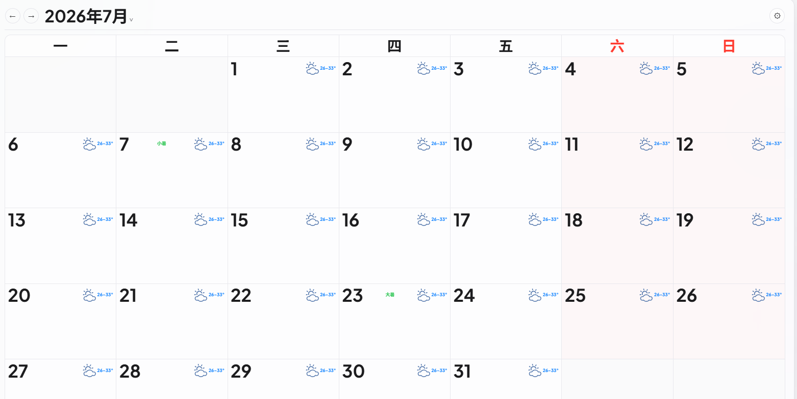
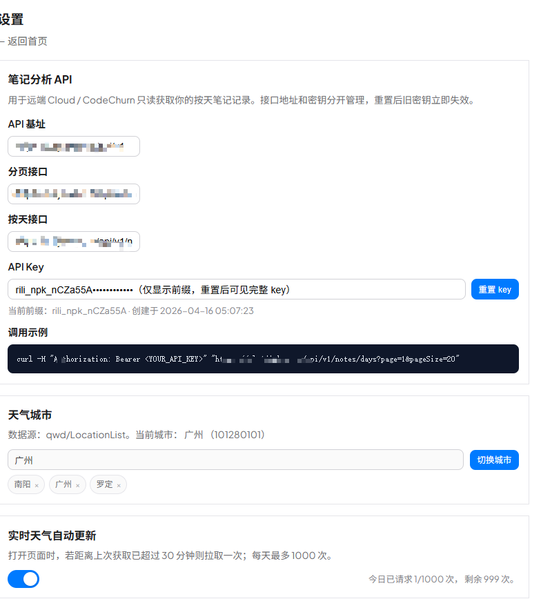
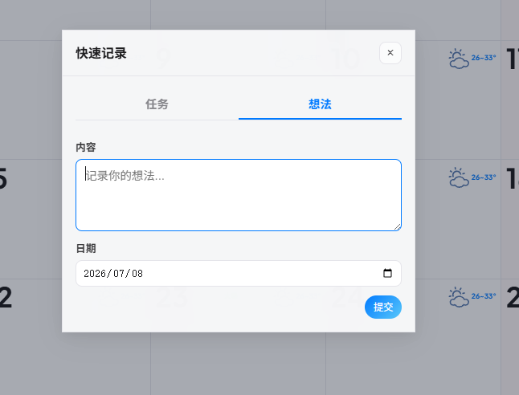

# Rili

[English](README.md) | [Simplified Chinese](README.zh-CN.md)

Life deserves to be recorded. When you look back on earlier days, Rili aims to keep those moments as useful traces.

Rili is a self-hosted personal productivity calendar built with Express, EJS, and SQLite. It includes:

- Calendar-based task management
- Kanban board
- Daily notes
- Holiday, solar term, and traditional festival display
- Weather city configuration and weather display
- Read-only Notes Analysis API

The project is designed for single-user self-hosting. It uses server-side rendering, keeps dependencies small, and is straightforward to deploy.

## Features

- `Tasks`: view, create, complete, edit, and delete tasks from a monthly calendar
- `Subtasks`: add subtasks under top-level tasks
- `Kanban`: manage tasks by status columns
- `Notes`: save daily notes to `data/notes/`
- `Settings`: manage password changes, API keys, and admin weather/holiday settings
- `Notes Analysis API`: let remote tools such as Claude Code, Cloud, or CodeChurn read daily notes

## Screenshots







## Tech Stack

- Node.js
- Express
- EJS
- better-sqlite3
- express-session with a SQLite session store

## Project Structure

```text
src/
  app.js                 Application entry point
  config.js              Environment variable configuration
  db/
    database.js          SQLite connection
    migrate.js           Database migrations
    seed.js              Initial account seeding
  middleware/
    auth.js              Login authentication
    notesApiAuth.js      Notes API key authentication
  routes/
    auth.js
    todos.js
    notes.js
    kanban.js
    admin.js
    settings.js
    api.js
  services/
    noteService.js
    notesApiKeyService.js
    weatherService.js
    ...
  views/
    todos.ejs
    notes.ejs
    kanban.ejs
    settings.ejs

data/
  todu.db                Main database
  sessions.sqlite        Session database
  notes/                 Note files
  holidays/              Holiday cache
  locations/             Weather location list cache
```

## Quick Start

### 1. Install dependencies

```bash
npm install
```

### 2. Configure environment variables

```bash
cp .env.example .env
```

Edit `.env` and set at least:

- `ADMIN_USERNAME`
- `ADMIN_PASSWORD`
- `SESSION_SECRET`
- Weather API settings, if weather display is needed: `WEATHER_API_BASE_URL` and either `WEATHER_API_KEY` or `WEATHER_API_TOKEN`

### 3. Initialize the database

```bash
npm run migrate
```

### 4. Create the initial account

```bash
npm run seed
```

The initial account is read from `.env`:

- Username: `ADMIN_USERNAME`
- Password: `ADMIN_PASSWORD`

### 5. Start development mode

```bash
npm run dev
```

### 6. Start production mode

```bash
npm start
```

Default URL:

```text
http://127.0.0.1:3000
```

## Fresh Install Flow

For a new installation, use this sequence:

```bash
cp .env.example .env
npm install
npm run migrate
npm run seed
npm start
```

What each step does:

- `cp .env.example .env`: creates the local private configuration file
- `npm run migrate`: creates `data/todu.db` and any missing tables
- `npm run seed`: creates the admin account from `ADMIN_USERNAME` and `ADMIN_PASSWORD`
- `npm start`: starts the app

## Migrating Existing Data

Move both of these paths when migrating to another server:

```text
data/todu.db
data/notes/
```

`data/todu.db` stores users, password hashes, tasks, and weather state. `data/notes/` stores daily notes. If you migrate only the database and skip `data/notes/`, notes will be lost.

## Common Commands

```bash
npm run dev          # Development mode
npm start            # Production start
npm run migrate      # Run database migrations
npm run seed         # Create the initial user
npm run holiday:sync # Manually sync holiday data
npm test             # Run tests
```

## Data Storage

### SQLite Database

Default main database path:

```text
data/todu.db
```

Default session database path:

```text
data/sessions.sqlite
```

### Note Files

Notes are stored on the file system instead of in the database:

```text
data/notes/{userId}/{year}/{month}/{date}.md
```

Example:

```text
data/notes/1/2026/04/2026-04-16.md
```

This means deployments and backups must preserve both the database and `data/notes/`.

## Environment Variables

Common environment variables:

```text
HOST
PORT
DB_PATH
NOTES_DATA_DIR
ADMIN_USERNAME
ADMIN_PASSWORD
SESSION_SECRET
SESSION_DB_DIR
NODE_ENV
SESSION_COOKIE_SECURE
HOLIDAY_SOURCE_PRIMARY
HOLIDAY_SOURCE_FALLBACK
WEATHER_API_BASE_URL
WEATHER_API_KEY
WEATHER_API_TOKEN
WEATHER_LOCATION_LIST_URL
WEATHER_LOCATION
WEATHER_LOCATION_NAME
```

Notes:

- `DB_PATH`: main database path, defaulting to `data/todu.db`
- `NOTES_DATA_DIR`: note file directory, defaulting to `data/notes`
- `SESSION_DB_DIR`: directory that stores the session SQLite database
- `ADMIN_USERNAME` / `ADMIN_PASSWORD`: initial admin account used by `npm run seed`
- `SESSION_SECRET`: must be changed in production
- `HOLIDAY_SOURCE_*`: holiday data source URLs
- `WEATHER_*`: weather API and location list configuration
- Weather icons live in `public/icons/weather/`

See `.env.example` for the full template. For a typical production deployment, keeping the default data paths is enough.

## Database Migrations

Migration entry point:

```bash
npm run migrate
```

Current migration behavior is incremental:

- Creates missing tables
- Adds missing columns
- Does not drop tables
- Does not clear existing data
- Does not rebuild note files

### Recommended Production Update Flow

Migrations are idempotent and backward-compatible, but production updates should still start with a backup:

```bash
cp data/todu.db data/todu.db.$(date +%F-%H%M%S).bak
cp -r data/notes data/notes.$(date +%F-%H%M%S).bak
```

Then run:

```bash
npm run migrate
```

## Deployment

### PM2

First start:

```bash
pm2 start src/app.js --name rili
```

Regular restart:

```bash
pm2 restart rili
```

If environment variables changed:

```bash
pm2 restart rili --update-env
```

### When to Use `--update-env`

Use `--update-env` only when environment variables changed, for example:

- `NODE_ENV`
- `PORT`
- `DB_PATH`
- `NOTES_DATA_DIR`
- Weather API settings

If only the code changed, a regular restart is enough.

### Recommended Deployment Order

```bash
cd /path/to/rili
cp data/todu.db data/todu.db.$(date +%F-%H%M%S).bak
cp -r data/notes data/notes.$(date +%F-%H%M%S).bak
npm install
npm run migrate
pm2 restart rili
```

If environment variables also changed:

```bash
pm2 restart rili --update-env
```

## Notes Analysis API

Rili provides read-only Notes Analysis API endpoints for remote tools such as Cloud, CodeChurn, and Claude Code. These endpoints read saved content from `/notes` by day.

### 1. Generate an API Key

After logging in, open:

```text
/settings
```

In the "Notes Analysis API" section, the page shows:

- `API Base URL`
- `Paginated endpoint`
- `Single-day endpoint`
- `API Key`

Important behavior:

- API keys and endpoint URLs are managed separately
- After resetting an API key, the old key becomes invalid immediately
- The full key is shown only when generated or reset; later pages show only the prefix

### 2. Authentication

All API requests use:

```text
Authorization: Bearer <YOUR_API_KEY>
```

Example:

```bash
curl -H "Authorization: Bearer rili_npk_xxx" \
  "https://your-domain.com/api/v1/notes/days?page=1&pageSize=20"
```

### 3. Endpoints

#### Paginated Daily Notes

```http
GET /api/v1/notes/days?page=1&pageSize=20
```

Parameters:

- `page`: page number, default `1`
- `pageSize`: items per page, default `20`, maximum `100`

Example:

```bash
curl -H "Authorization: Bearer <YOUR_API_KEY>" \
  "https://your-domain.com/api/v1/notes/days?page=1&pageSize=20"
```

Example response:

```json
{
  "items": [
    {
      "date": "2026-04-16",
      "updatedAt": "2026-04-16T05:10:23.000Z",
      "entryCount": 2,
      "combinedText": "[09:15] First entry\n\n[18:45] Second entry",
      "entries": [
        {
          "index": 0,
          "time": "09:15",
          "recordedAt": "2026-04-16T09:15:00",
          "content": "First entry"
        },
        {
          "index": 1,
          "time": "18:45",
          "recordedAt": "2026-04-16T18:45:00",
          "content": "Second entry"
        }
      ]
    }
  ],
  "pagination": {
    "page": 1,
    "pageSize": 20,
    "totalItems": 1,
    "totalPages": 1,
    "hasMore": false
  },
  "meta": {
    "generatedAt": "2026-04-16T05:11:00.000Z",
    "timezone": "Asia/Shanghai",
    "version": "v1"
  }
}
```

#### Single-Day Notes

```http
GET /api/v1/notes/days/:date
```

Example:

```bash
curl -H "Authorization: Bearer <YOUR_API_KEY>" \
  "https://your-domain.com/api/v1/notes/days/2026-04-16"
```

Example response:

```json
{
  "item": {
    "date": "2026-04-16",
    "updatedAt": "2026-04-16T05:10:23.000Z",
    "entryCount": 2,
    "combinedText": "[09:15] First entry\n\n[18:45] Second entry",
    "entries": [
      {
        "index": 0,
        "time": "09:15",
        "recordedAt": "2026-04-16T09:15:00",
        "content": "First entry"
      },
      {
        "index": 1,
        "time": "18:45",
        "recordedAt": "2026-04-16T18:45:00",
        "content": "Second entry"
      }
    ]
  },
  "meta": {
    "generatedAt": "2026-04-16T05:11:00.000Z",
    "timezone": "Asia/Shanghai",
    "version": "v1"
  }
}
```

### 4. Response Fields

Daily note item:

- `date`: date in `YYYY-MM-DD` format
- `updatedAt`: last modified time of the note file for that day
- `entryCount`: number of entries for the day
- `combinedText`: all text entries for the day combined into one string, useful for summarization or analysis
- `entries`: individual note entries for the day

Single entry:

- `index`: entry index for the day, starting from `0`
- `time`: recorded time in `HH:mm` format
- `recordedAt`: timestamp built from `date + time`; `null` when time is missing
- `content`: entry text

Pagination:

- `page`
- `pageSize`
- `totalItems`
- `totalPages`
- `hasMore`

Metadata:

- `generatedAt`
- `timezone`
- `version`

### 5. Suggested Prompt for Claude Code / Cloud

If you want Claude Code or another analysis tool to use these endpoints, provide:

- `Base URL`
- `API Key`
- Paginated endpoint
- Single-day endpoint
- Authentication header format
- Response field descriptions

You can give it this prompt:

```text
You can read my diary data through this API:

Base URL: https://your-domain.com/api/v1
API Key: <YOUR_API_KEY>
Paginated endpoint: GET /notes/days?page=1&pageSize=20
Single-day endpoint: GET /notes/days/:date

Request header:
Authorization: Bearer <YOUR_API_KEY>

Please fetch the last 7 days first, then summarize them.
```

### 6. Current Limitations

- The API is read-only and does not support external writes, edits, or deletes
- The API does not currently return weather fields
- Raw note data is still stored in the `data/notes/` directory, not in the database

## Tests

Run:

```bash
npm test
```

## Notes

- Always change `SESSION_SECRET` and `ADMIN_PASSWORD` in production, and use your own weather API key or token
- When migrating servers, move both `data/todu.db` and `data/notes/`
- A full Notes Analysis API key is shown only when generated or reset, so save it immediately

